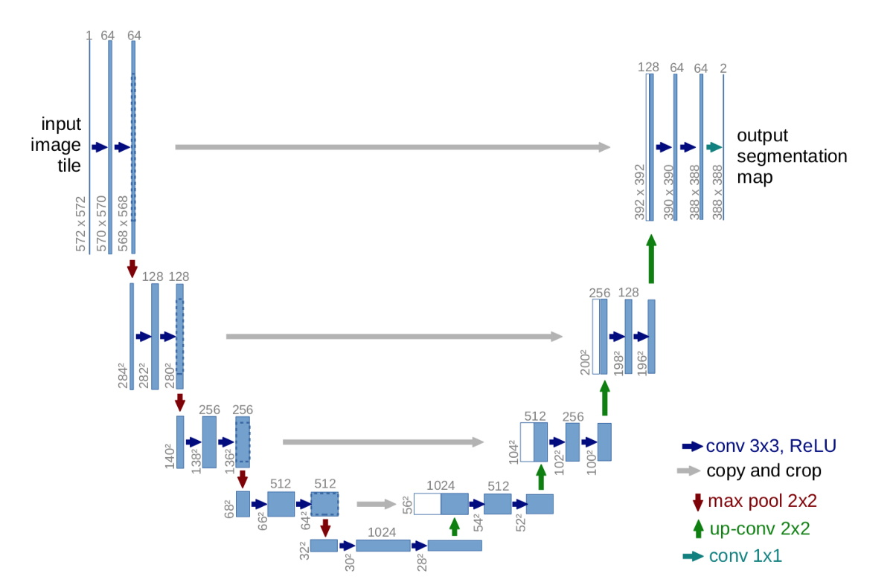

# Semantic Segmentation with U-Net on Carvana Dataset

PyTorch implementation of the U-Net from the [U-Net: Convolutional Networks for Biomedical Image Segmentation](https://arxiv.org/abs/1505.04597) paper. The model has been trained on the [Carvana Dataset](https://www.kaggle.com/competitions/carvana-image-masking-challenge/data) from Kaggle, which contains photos of cars in a studio setting along with their binary segmentation maps (car vs not-car). Testing of the model is done on unseen samples from the same dataset, along with photos of cars outside the dataset.

### For the project, I've also:

-   Improved on the model's architecture by applying batch normalization.
-   Checked out the effectiveness of the copy-crop connections, proposed in the paper, at improving the model's segmentation localization abilities.
-   Visualized what the model is looking for.

## UNet with Batch Normalization

### Hyperparameters

Learning rate: `1e-4`\
Batch size: `32`\
Epochs: `20`

Image height: `240px`\
Image width: `360px`

### Results

Dice score: `0.991`

|                                  Image                                   |                           Image + Segmentation Map                            |
| :----------------------------------------------------------------------: | :---------------------------------------------------------------------------: |
|        |        |
|        |        |
|  |  |

The segmentation is quite sharp in the first two tests. The model cleanly distinguishes between the car and the floor/background.\
However, the model struggles to generalize to real world environments, as it has only seen studio backgrounds.

## Removing the Copy-Crop connections

I wanted to test out the effectiveness of the copy-crop (shown in grey) connections, in helping the model localize.\
So, I removed them.

### Hyperparameters

Learning rate: `1e-4`\
Batch size: `32`\
Epochs: `20`

Image height: `240px`\
Image width: `360px`

### Results

Dice score: `0.9504`\
_This is considerably lower than that with the copy-crop connections._

|                             Without copy-crop                             |                             With copy-crop                              |
| :-----------------------------------------------------------------------: | :---------------------------------------------------------------------: |
|  |  |
|  |  |
|  |  |

Without the copy-crop connections, the model's segmentation is not sharp. It is unable to localize without the high-resolution features provided by the copy-crop concatenation.

## What is the Network looking for?

Finally, I wanted to see what the network looks for in the images. So, I decided to plot the feature maps output by the first set of double convolutions in the unet.

_Brighter spots denote higher activation in the feature map._

Most of the feature maps show no significant activation distributions. These probably correspond to kernels that look for cars in a different orientation.

However, there are a few feature maps that strongly highlight the car's windshield, front-bumper, and wheels, and others that highlight its body. This suggests that the network is able to understand the individual parts of a car, and uses this knowledge to fine tune its segmentation.
